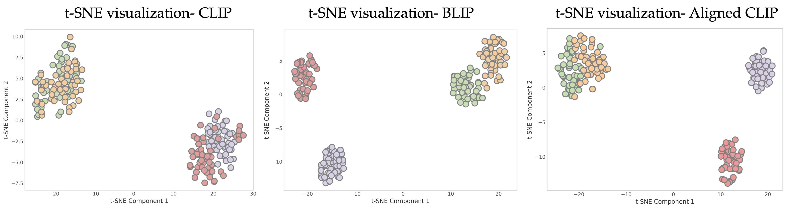

  <strong>Figure 1: Comparison of Kernel Heatmaps and t-SNE Visualizations Before and After Aligning CLIP with DINOv2 on KODA-Discovered Samples.</strong>

  

  <strong>Figure 2: Comparison of t-SNE Visualizations Before and After Aligning CLIP with BLIP on KODA-Discovered Samples.</strong>

  

  <strong>Figure 3: DINOv2–CLIP Mismatch Directions Identified by KODA and SPEC, with Generalized Rayleigh Quotient Analysis on ImageNet Dog Breeds Dataset.</strong>

  

  <strong>Figure 4: Multimodal Discrepancy Analysis of OpenCLIP-Dominant Directions Relative to SigLIP on MSCOCO: Image-Only vs. Joint Representations.</strong>

  

  <strong>Figure 5: Multimodal Discrepancy Analysis of SigLIP-Dominant Directions Relative to OpenCLIP on MSCOCO: Image-Only vs. Joint Representations.</strong>

  

